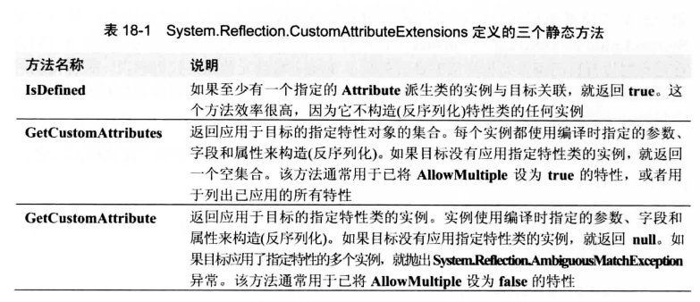

[TOC]

# 什么时特性
定制特性允许为几乎每一个元数据表记录项定义和应用信息。这种可扩展的元数据信息能在运行时查询，从而动态改变代码的执行方式。关于自定义特性，首先要知道它们只是将一些附加信息与某个目标元素关联起来的方式。编译器在托管模块的元数据中生成(嵌入)这些额外的信息。大多数特性对编译器来说没有意义；编译器只是机械地检测源代码中的特性，并生成对应的元数据。

CLR 允许将特性应用于可在文件的元数据中表示的几乎任何东西。不过，最常应用特性的还是以下定义表中的记录项：`TypeDef(类、结构、枚举、接口和委托)，MethodDef(含构造器)，ParamDef，FieldDef，PropertyDef，EventDef，AssemblyDef和ModuleDef`。更具体地说，C# 只允许将特性应用于定义以下任何目标元素的源代码：程序集、模块、类型(类、结构、枚举、接口、委托)、字段、方法(含构造器)、方法参数、方法返回值、属性、事件和泛型类型参数。
可将多个特性应用于一个目标元素。某些特性可以多次的应用于同一个目标元素。

---------------

# 特性的本质

定制特性其实是一个类型的实例。为了符合“公共语言规范”(CLS)的要求，定制特性类必须直接或间接从公共抽象类 System.Attribute派生。C# 只允许符合 CLS 规范的特性。查看文档会发现定义了以下类(参见前面的例子)；StructLayoutAttribute，MarshalAsAttribute，DllImportAttribute，InAttribute 和 OutAttribute。所有这些类碰巧都在System.Runtime.InteropServices命名空间中定义。但特性类可以在任何命名空间中定义。进一步查看，会发现所有这些类都从System.Attribute派生，所有符合 CLS 规范的特性类都肯定从这个类派生类。

特性是类的实例。类必须有公共构造器才能创建它的实例。所以，将特性应用于目标元素时，语法类似于调用类的某个实例构造器。如下所示
```csharp
[DllImport("Kernel32", CharSet = CharSet.Auto, SetLastError = true)]
```
这一行代码的语法表面上看很奇怪，因为调用构造器时永远不会使用这样的语法。查阅DllImportAttribute 类的文档，会发现它的构造器要求接受一个 String 参数。在这个例子中。“Kernel32”将传给这个参数。构造器的参数称为定位参数(positional parameter)，而且是强制性的：也就是说，应用特性时必须指定参数。

那么，另外两个“参数”是什么呢？这种特殊的语法允许在构造好 DllImportAttribute 对象后设置对象的任何公共字段或属性。在这个例子中，将“Kernel32”传给构造器并构造好 DllImportAttribute 对象之后，对象的公共实例字段 CharSet 和 SetLastError 分别设为CharSet.Auto和true。用于设置字段或属性的“参数”称为命名参数(named parameter)。这种参数是可选的，因为在应用特性的实例时不一定要指定参数。稍后会解释是什么导致了实际地构造DllImportAttribute类的实例。

--------------------------

# 编译器对特性的处理
当编译器检测到向目标元素应用了定制特性时，会调用特性类的构造器，向它传递任何指定的参数，从而构造特性类的实例。然后，编译器采用增强型构造器语法所指定的值，对任何公共字段和属性进行初始化。构造并初始化好定制特性类的对象之后，编译器将它的状态序列化到目标元素的元数据表记录项中。可以这样想象定制特性：它是类的实例，被序列化成驻留在元数据中的字节流。运行时可对元数据中的字节进行反序列化，从而构造出类的实例。实际发生的事情是：编译器在元数据中生成创建特性类的实例所需的信息。每个构造器参数都会 1 字节的类型 ID，后跟具体的值。对构造器的参数进行“序列化”时，编译器先写入字段/属性名称，再跟上 1 字节的类型 ID，最后是具体的值。

-------------------

# CLR如何处理特性
仅仅定义特性类没有用。确实可以定义自己想要的所有特性类，并应用自己想要的所有实例。但这样除了在程序集中生成额外的元数据，没有其他任何意义。应用程序代码的行为不会有任何改变。Flags 特性应用于枚举类型，从而改变 System.Enum 的 ToString 和 Format 方法的行为。方法的行为之所以改变，是因为它们会在运行时检查自己操作的枚举类型是否关联了 Flags 特性元数据。代码利用一种称为反射的技术检测特性的存在。
假定你是 Microsoft 的员工，负责实现 Enum 的 ToString 方法，你会像下面这样实现它：

```csharp
public override String ToString() {

    // 枚举类型是否应用了 FlagsAttribute 类型的实例 ？
    if (this.GetType().IsDefined(typeof(FlagsAttribute), false)) {
        // 如果是，就执行代码，将值视为一个位标志枚举类型
        ...
    } else {
        // 如果不是，就执行代码，将值视为一个普通枚举类型
        ...
    }
    ...
}
```

上述代码调用 Type 的 IsDefined 方法，要求系统查看枚举类型的元数据，检查是否关联了 FlagsAttribute 类的实例。如果IsDefined返回true，表明FlagsAttribute的一个实例已与枚举类型关联，ToString方法认为值包含一个位标志(bit flag)集合。如果IsDefined返回false，Format方法认为值是普通的枚举类型。
因此，在定义定制特性时，也必须实现一些代码来检测某些目标上是否存在该特性类的实例，然后执行一些逻辑分支代码。这样定制特性才能正真发挥作用。

FCL 提供了多种方式来检测特性的存在。如果通过 System.Type 对象来检测特性，可以像前面展示的那样使用 IsDefined 方法。但有时需要检测除了类型之外的其他目标(比如程序集、模块或方法)上的特性。为简化讨论，让我们聚焦于 System.Reflection.CustomAttributeExtensions 类定义的扩展方法。该类定义了三个静态方法来获取与目标关联的特性：IsDefined，GetCustomAttributes 和 GetCustomAttribute。 每个方法都有几个重载版本。例如，每个方法都有一个版本能操作类型成员(类、结构、枚举、接口、委托、构造器、方法、属性、字段、事件和返回类型)、参数、模块和程序集。还有一些版本能指示系统遍历继承层次结构，在结果中包含继承的特性。表 18-1 简要总结了每个方法的用途，它们在元数据上反射以查找与 CLS 相容的定制特性类型的实例。



如果只想判断目标是否应用了一个特性，那么应该调用 IsDefined，因为它比另两个方法更高效。但我们知道，将特性应用于目标时，可以为特性的构造器指定参数，并可选择设置字段和属性。使用 IsDefined 不会构造特性对象，不会调用构造器，也不会设置字段和属性。

要构造特性对象，必须调用 GetCustomAttributes 或 GetCustomAttribute 方法。每次调用这两个方法，都会构造指定特性类型的新实例，并根据源代码中指定的值来设置每个实例的字段和属性。两个方法返回的都是对完全构造好的特性类实例的引用。

调用上述任何方法，内部都必须扫描托管模块的元数据，执行字符串比较来定位指定的定制特性类。显然，这些操作会耗费一定时间。假如对性能的要求比较高，可考虑缓存这些方法的调用结果，而不是反复调用来请求相同的信息。

System.Reflection 命名空间定义了几个类允许检查模块的元数据。这些类包括 Assembly，Module，ParameterInfo，MemberInfo，Type，MethodInfo，Type，MethodInfo，ConstructorInfo，FieldInfo，EventInfo，PropertyInfo及其各自的 *Builder 类。所有类都提供了 IsDefined 和 GetCustomAttributes方法。

反射类提供的 GetCustomAttribute 方法返回的是由 Object 实例构成的数组(Object[])，而不是由 Attribute 实例构成的数组(Attribute[])。这是由于反射类能返回不相容于 CLS 规范的特性类的对象。不过，大可不必关心这种不一致性，因为非 CLS 相容的特性是很稀少的。