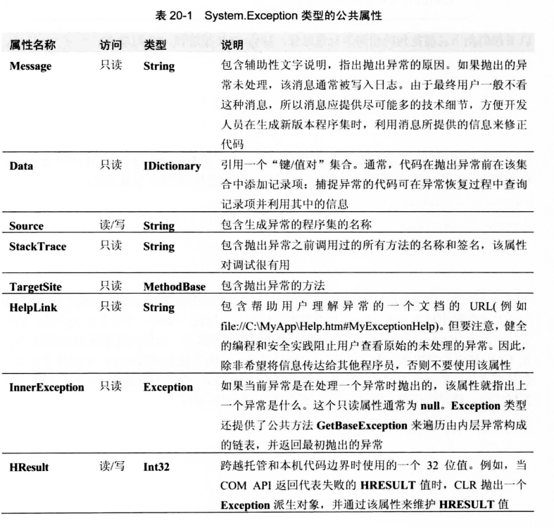

[TOC]

# CLR 异常处理机制

假设由如下代码
```csharp
private void SomeMethod() {

    try {
        // 需要得体地进行恢复和/或清理的代码放在这里
    }
    catch (InvalidOperationException) {
        // 从 InvalidOperationException 恢复的代码放在这里
    }
    catch (IOException) {
        // 从 IOException 恢复的代码放在这里
    }
    catch {
        // 从除了上述异常之外的其他所有异常恢复的代码放在这里
        ...
        // 如果什么异常都捕捉，通常要重新抛出异常。本章稍后将详细解释
        throw；
    }
    finally {
        // 这里的代码对始于 try 块的任何操作进行清理
        // 这里的代码总是执行，不管是不是抛出了异常
    }
    // 如果 try 块没有抛出异常，或者某个 catch 块捕捉到异常，但没有抛出或
    // 重新抛出异常，就执行下面的代码
    ...
}
```

- try块 
  - 用来包含可能出现异常的代码
- catch块
  - catch块包含的是响应一个异常需要执行的代码
- finally块
  - finally块包含的是保证会执行的代码(在某些情况下不一定会执行)。一般在 finally 块中执行try块的行动所要求的资源清理操作。

在 try 块的代码(或者从 try 块调用的任何方法)中抛出异常，CLR将搜索捕捉类型与抛出的异常相同(或者是它的基类)的 catch 块。如果没有任何捕捉类型与抛出异常匹配，CLR 会去调用栈更高的一层搜索与异常匹配的捕捉类型。如果都到了调用栈的顶部，还是没有找到匹配的 catch 块，就会发生未处理的异常。
一旦 CLR 找到匹配的 catch 块，就会执行内层所有 finally 块中的代码。所谓 “内层finally块”是指从抛出异常的try块开始，到匹配异常的catch块之间的所有finally块。注意，匹配异常的那个 catch 块所关联的 finally块尚未执行，该finally块中的代码一直要等到这个catch 块中的代码执行完毕才会执行。


所有内层 finally 块执行完毕之后，匹配异常的那个 catch 块中的代码才开始执行。catch 块中的代码通常执行一些对异常进行处理的操作。在 catch 块的末尾，我们有以下三个选择。

- 重新抛出相同的异常，向调用栈高一层的代码通知该异常的发生。

- 抛出一个不同的异常，向调用栈高一层的代码提供更丰富的异常信息。

- 让线程从 catch 块的底部退出。

选择最后一种技术，当线程从 catch 块的底部退出后，它将立即执行包含在 finally 块④(如果有的话)中的代码。finally块的所有代码执行完毕后，线程退出 finally 块，执行紧跟在 finally 块之后的语句。如果不存在 finally 块，线程将从最后一个 catch 块之后的语句开始执行。

当然，(catch中的)异常恢复代码或(finally 中的)清理代码总是有可能失败并抛出异常的。但这个可能性不大。而且如果真的发生，通常意味着某个地方出了很严重的问题。很可能是某些状态在一个地方发生了损坏。即使catch或finally块内部抛出了异常也不是世界末日———— CLR 的异常机制仍会正常运转，好像异常是在finally块之后抛出的第一个异常，关于第一个异常的所有信息(例如堆栈跟踪)都将丢失 。这个新异常可能(而且极有可能)不会由你的代码处理，最终变成一个未处理的异常。在这种情况下，CLR 会终止你的进程。这是件好事情，因为损坏的所有状态现在都会被销毁。相较于让应用程序继续运行，造成不可预知的结果以及可能的安全漏洞，这样处理要好得多！


# CLR对Exception对象的处理

派生自 System.Exception 的异常类型被认为是 CLS 相容的。C# 和其他许多语言的编译器都只允许抛出 CLS 相容的异常。System.Exception 类型的公共属性如下所示


这里有必要讲一下 System.Exception 类型提供的只读 StackTrace 属性。catch 块可读取该属性来获取一个堆栈跟踪(stack trace)，它描述了异常发生前调用了哪些方法。检查异常原因并改正代码时，这些信息是很有用的。访问该属性实际会调用 CLR 中的代码；该属性并不是简单地返回一个字符串。构造 Exception 派生类型的新对象时，StackTrace 属性被初始化为 null。如果此时读取该属性，得到的不是堆栈跟踪，而是一个 null。

一个异常抛出时，CLR 在内部记录 throw 指令的位置(抛出位置)。一个 catch 块捕捉到该异常时，CLR 记录捕捉位置。在 catch 块内访问被抛出的异常对象的 StackTrace 属性，负责实现该属性的代码会调用 CLR 内部的代码，后者创建一个字符串来指出从异常抛出位置到异常捕捉位置的所有方法。

以下代码抛出它捕捉到的相同的异常对象，导致 CLR 重置该异常的起点：

```csharp
private void SomeMethod() {
    try { ... }
    catch (Exception e) {
        ...
        throw e;        // CLR 认为这是异常的起点， FxCop 报错
    }
}
```

但如果仅仅使用 throw 关键字本身(删除后面的 e)来重新抛出异常对象，CLR 就不会重置堆栈的起点。以下代码重新抛出它捕捉到的异常，但不会导致 CLR 重置起点：

```csharp
private void SomeMethod() {
    try { ... }
    catch (Exception e) {
        ...
        throw;    // 不影响 CLR 对异常起点的认知。 FxCop 不再报错
    }
}
```

实际上，两段代码唯一的区别就是 CLR 对于异常起始抛出位置的认知。遗憾的是，不管抛出还是重新抛出异常，Windows 都会重置栈的起点。因此，如果一个异常成为未处理的异常，那么向 Windows Error Reporting 报告的栈位置就是最后一次抛出或重新抛出的位置(即使 CLR 知道异常的原始抛出位置)。之所以遗憾，是因为假如应用程序在字段那里失败，会使调试工作变得异常困难。有些开发人员无法忍受这一点，于是选择以一种不同的方式实现代码，确保堆栈跟踪能真正反映异常的原始抛出位置：

```csharp
private void SomeMethod() {
    Boolean trySucceeds = false;

    try {
        ...
        trySucceeds = true;
    }
    finally {
        if (!trySucceeds) { /*捕捉代码放到这里*/ }
    }
}
```
StackTrace 属性返回的字符串不包含调用栈中比接受异常对象的那个 catch 块高的任何方法。要获得从线程起始处到异常处理程序(catch 块)之间的完整堆栈跟踪，需要使用 System.Diagnostics.StackTrace 类型。该类型定义了一些属性和方法，允许开发人员程序化地处理堆栈跟踪以及构成堆栈跟踪的栈桢。
`栈顶移动即“升高”，向栈底移动即“降低”。栈桢(stack frame)代表当前线程的调用栈中的一个方法调用。执行线程的过程中进行的每个方法调用都会在调用栈中创建并压入一个 StackFrame`

可用几个不同的构造器来构造一个 StackTrace 对象。一些构造器构造从线程起始处到 StackTrace 对象的构造位置的栈桢。另一些使用作为参数传递的一个 Exception 派生对象来初始化栈桢。

如果 CLR 能找到你的程序集的调试符号(存储在.pdb 文件中)，那么在System.Exception的 StackTrace 属性或者 System.Diagnostics.StackTrace 的 ToString 方法返回的字符串中，将包括源代码文件路径和代码行号，这些信息对于调试是很有用的。

获得堆栈跟踪后，可能发现实际调用栈中的一些方法没有出现在堆栈跟踪字符串中。这可能有两方面的原因。首先，调用栈记录的是线程的返回位置(而非来源位置)。其次， JIT 编译器可能进行了优化，将一些方法内联(inline)，以避免调用单独的方法并从中返回的开销。许多编译器(包括 C#编译器)都支持/debug命令行开关。使用这个开关，编译器会在生成的程序集中嵌入信息，告诉 JIT 编译器不要内联程序集的任何方法，确保调试人员获得更完整、更有意义的堆栈跟踪。

`注意 JIT 编译器会检查应用于程序集的 System.Diagnostics.Debuggabletrribute 定制特性。C# 编译器会自动应用该特性。如果该特性指定了 DisableOptimizations 标志，JIT 编译器就不会对程序集的方法进行内联。使用 C# 编译器的 /debug 开关就会设置这个标志。另外，向方法应用定制特性 System.Runtime.CompilerServices.MethodImplAttribute 将禁止 JIT 编译器在调试和发布生成(debug and release build)时对该方法进行内联处理`

-------------------

# 未处理的异常

异常抛出时，CLR 在调用栈中向上查找与抛出的异常对象的类型匹配的catch块。没有任何catch块匹配抛出的异常类型，就发生一个未处理的异常。CLR检测到进程中的任何线程有未处理的异常，都会终止进程。未处理异常表明应用程序遇到了未预料到的情况，并认为这是应用程序的真正 bug。随后，应将 bug 报告给发布该应用程序的公司。这个公司也许会修复 bug，并发布应用程序的新版本。

类库开发人员压根儿用不着去想未处理的异常。只有应用程序的开发人员才需关心未处理的异常。而且应用程序应建立处理未处理异常的策略。Microsoft 建议应用程序开发人员接受 CLR 的默认策略。也就是说，应用程序发生未处理的异常时，Windows 会向事件日志写一条记录。为了查看该记录，可打开“事件查看器”应用程序，然后打开树结构中的“Windows日志”->“应用程序”节点.
应用程序初始化时，可告诉 CLR 当应用程序中的任何线程发生一个未处理的异常时，都调用一个方法。


在 CLR 中，我们有包含了状态的 AppDomain(将在第 22 章讨论)。AppDomain 卸载时，它的所有状态都会卸载。所以，如果 AppDomain 中的一个线程遭遇未处理的异常，可以在不终止整个进程的情况下卸载 AppDomain(会销毁它的所有状态)。如果线程的整个生命期都在一个 AppDomain 的内部(比如 ASP.NET 和托管 SQL Server 存储过程)，这个说法是完全成立的。但如果线程在其生存期内跨越了 AppDomain 边界，可能就不得不终止整个进程了。