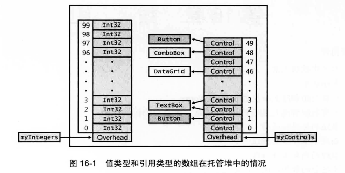

- [数组的内存布局](#数组的内存布局)
- [CLR 对数组的处理](#clr-对数组的处理)
  - [所有数组都隐式派生自 `System.Array`](#所有数组都隐式派生自-systemarray)
  - [所有数组都隐式实现 `IEnumerable`，`ICollection`和`IList`](#所有数组都隐式实现-ienumerableicollection和ilist)


# 数组的内存布局

数组是允许将多个数据项作为集合来处理的机制。CLR 支持一维、多维和交错数组(即数组构成的数组)。所有数组类型都隐式地从 `System.Array` 抽象类派生，后者又派生自 `System.Object`。意味着数组始终是引用类型，是在托管堆上分配的。在应用程序的变量或字段中，包含的是对数组的引用，而不是包含数组本身的元素。
```csharp
Int32[] myIntegers;                 // 声明一个数组引用
myIntegers = new Int32[100];        // 创建含有 100 个 Int32 的数组
```
第一行代码声明 myIntegers 变量，它能指向包含 Int32 值的一维数组。myIntegers 刚开始设为 null，因为当时还没有分配数组。第二行代码分配了含有 100 个 Int32 值的数组，所有 Int32 都被初始化为 0。由于数组是引用类型，所以会在托管堆上分配容纳 100 个未装箱Int32所需的内存块。实际上，除了数组元素，数组对象占据的内存块还包含一个类型对象指针、一个同步块索引和一些额外的成员,这些额外的成员称为 overhead 字段或者说“开销字段”。

还可创建引用类型的数组：
```csharp
Control[] myControls;               // 声明一个数组引用
myControls = new Control[50];       // 创建含有 50 个 Control 引用的数组
myControls[1] = new Button();
myControls[2] = new TextBox();
myControls[3] = myControls[2];
myControls[46] = new DataGrid();
myControls[48] = new ComboBox();
myControls[49] = new Button();
```
第一行代码声明myControls 变量，它能指向包含 Control 引用的一维数组。myControls 刚开始被设为 null，因为当时还没有分配数组。第二行代码分配了含有 50 个 Control 引用的数组，这些引用全被初始化为null。由于 Control 是引用类型，所以创建数组只是创建了一组引用，此时没有创建实际的对象。
值类型和引用类型的数组在托管堆中的情况，如下所示



应尽可能使用一维 0 基数组，有时也将这种数组称为 SZ②数组或向量(vector)。向量的性能是最佳的，因为可以使用一些特殊的 IL 指令(比如 newarr，ldelem，ldelema，ldlen 和 stelem)来处理。


# CLR 对数组的处理

## 所有数组都隐式派生自 `System.Array`

像下面这样声明数组变量：
```csharp
FileStream[] fsArray;
```
CLR 会自动为 AppDomain 创建一个 `FileStream[]` 类型。该类型隐式派生自 `System.Array`类型；因此，`System.Array`类型定义的所有实例方法和属性都将由 `FileStream[]` 继承，使这些方法和属性能通过 `fsArray` 变量调用。这极大方便了数组处理，因为`System.Array`定义了许多有用的实例方法和属性，比如 `Clone`，`CopyTo`，`GetLength`，`GetLongLength`，`GetLowerBound`，`GetUpperBound`，`Length`，`Rank`等。

`System.Array`类型还公开了很多有用的、用于数组处理的静态方法。这些方法均获取一个数组引用作用作为参数。一些有用的静态方法包括：`AsReadOnly，BinarySearch，Clear，ConstrainedCopy，ConvertAll，Copy，Exists，Find，FindAll，FindIndex，FindLast，FindLastIndex，Foreach，IndexOf，LastIndexOf，Resize，Sort和TrueForAll`。这些方法中，每个都有多个重载版本，能保障编译时的类型安全性和良好的性能.

## 所有数组都隐式实现 `IEnumerable`，`ICollection`和`IList`

许多方法都能操纵各种各样的集合对象，因为它们声明为允许获取IEnumerable，ICollection和IList等参数。可将数组传给这些方法，因为System.Array也实现了这三个接口。System.Array之所以实现这些非泛型接口，是因为这些接口将所有元素都视为System.Object。然后，最后是让System.Array实现这些接口的泛型形式，提供更好的编译时类型安全性和更好的性能。

不过，由于涉及多维数组和非 0 基数组的问题，CLR 团队不希望 System.Array 实现IEnumerable<T>，ICollection<T>和IList<T>。若在System.Array上定义这些接口，就会为所有数组类型启用这些接口。所以，CLR没有那么做，而是耍了一个小花招；创建一维 0 基数组类型时，CLR 自动使数组类型实现IEnumerable<T>，ICollection<T>和IList<T>(T是数组元素的类型)。同时，还为数组类型的所有基类型实现这三个接口，只要它们是引用类型。以下层次结构图对此进行了澄清：

```
Object
    Array (非泛型 IEnumerable, ICollection, IList)
        Object[]            (IEnumerable, ICollection, IList of Object)
          String[]          (IEnumerable, ICollection, IList of String)
          Stream[]          (IEnumerable, ICollection, IList of Stream)
            FileStream[]    (IEnumerable, ICollection, IList of FileStream)
         .
         .      (其他引用类型的数组)
         .
```

所以，如果执行以下代码：

```csharp
FileStream[] fsArray;
```

那么当 CLR 创建FileStream[]类型时，会自动为这个类型实现 `IEnumerable<FileStream>，ICollection<FileStream>和IList<FileStream>`接口。此外，`FileStream[]`类型还会为基类型实现接口：`IEnumerable<Stream>，IEnumerable<Object>，ICollection<Stream>，ICollection<Object>，IList<Stream>和IList<Object>`。由于所有这些接口都由 CLR 自动实现，所以在存在这些接口任何地方都可以使用 fsArray 变量。例如，可将 fsArray 变量传给具有以下任何一种原型的方法：

```
void M1(IList<FileStream> fsList) { ... }
void M2(ICollection<Stream> sCollection) { ... }
void M3(IEnumerable<Object> oEnumerable) { ... }
```

注意，如果数组包含值类型的元素，数组类型不会为元素的基类型实现接口。例如，如果执行以下代码：

```csharp
DateTime[] dtArray; // 一个值类型的数组
```

那么 `DateTime[]` 类型只会实现 `IEnumerable<DateTime>`，`ICollection<DateTime>`和`IList<DateTime>`接口，不会为`DateTime`的基类型(包括`System.ValueType和System.Object`)实现这些泛型接口。这意味着dtArray变量不能作为实参传给前面的M3方法。这是因为值类型的数组在内存中的布局与引用类型的数组不同。