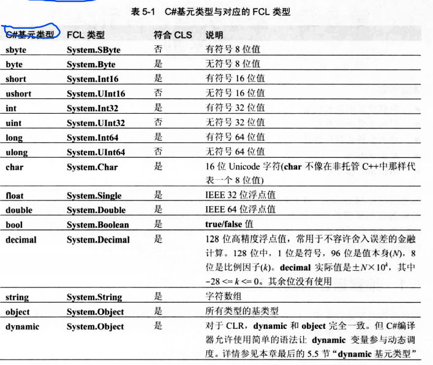

- [类型基础](#类型基础)
  - [类型的分类](#类型的分类)
    - [基元类型](#基元类型)
    - [引用类型和值类型](#引用类型和值类型)
    - [值类型和引用类型的区别](#值类型和引用类型的区别)
    - [非基元类型的类型转换](#非基元类型的类型转换)
    - [基元类型的类型转换](#基元类型的类型转换)
  - [值类型的装箱和拆箱](#值类型的装箱和拆箱)
      - [装箱机制](#装箱机制)
    - [拆箱机制](#拆箱机制)
    - [装箱的时机](#装箱的时机)
  - [new操作符工作原理](#new操作符工作原理)
    - [对于引用类型来说](#对于引用类型来说)
    - [对象的组成](#对象的组成)
    - [类型对象的组成](#类型对象的组成)


# 类型基础
C#中无论是值类型还是引用类型都是从**System.Object**类型派生而来的。**System.Object**提供了如下一些方法。

|   公共方法    |                             说明                             |
| :-----------: | :----------------------------------------------------------: |
|   `Equals`    | 如果两个对象具有相同的值，就返回 `true`。即检查对象的同一性           |
| `GetHashCode` | 返回对象的值的哈希码。如果某个类型的对象要在哈希表集合(比如 `Dictionary`)中作为键使用，该类型应重写该方法。方法应该为不同对象提供 *良好分布* 。将这个方法设计到 `Object` 中并不恰当。大多数类型永远不会在哈希表中作为键使用；该方法本该在接口中定义。欲知该方法的详情，请参见 5.4 节“对象哈希码” |
|  `ToString`   | **默认返回类型的完整名称**(`this.GetType().FullName`)。但经常重写该方法来返回包含对象状态表示的 `String` 对象。例如，核心类型(如 `Boolean` 和 `Int32`)重写该方法来返回它们的值的字符串表示。另外，经常出于调试的目的而重写该方法；调用后获得一个字符串，显示对象各字段的值。事实上，Microsoft Visual Studio 的调试器会自动调用该函数来显示对象的字符串表示。注意，`ToString` 理论上应察觉与调用线程关联的 `CultureInfo` 并采用相应行动。第 14 章“字符、字符串和文本处理”将更详细地讨论 `ToString` |
|   `GetType`   | 返回从 `Type` 派生的一个类型的实例，指出调用 `GetType` 的那个对象是什么类型。返回的 `Type` 对象可以和反射类配合，获取与对象的类型有关的元数据信息。反射将在第 23 章“程序集加载和反射”讨论。 `GetType` 是非虚方法，目的是防止类重写该方法，隐瞒其类型，进而破坏类型安全性 |

**System.Object**类型提供的受保护方法如下所示。

|    受保护方法     |                             说明                             |
| :---------------: | :----------------------------------------------------------: |
| `MemberwiseClone` | 这个非虚方法创建类型的新实例，并将新对象的实例字段设与 `this` 对象的实例字段完全一致。返回对新 *实例* 的引用（浅复制） |
|    `Finalize` (也就是析构函数)    | 在垃圾回收器判断对象应该作为垃圾被回收之后，在对象的内存被实际回收之前，会调用这个虚方法。需要在回收内存前执行清理工作的类型应重写该方法。第 21 章“托管堆和垃圾回收”会更详细地讨论这个重要的方法 |


## 类型的分类

### 基元类型

编译器直接支持的数据类型称为**基元类型**，**基元类型**直接对应到**FCL**中的某个类型，如下所示。



### 引用类型和值类型

CLR 支持两种类型：引用类型和值类型。

对于引用类型有如下几个特点
- 内存必须从托管堆分配。
- 堆上分配的每个对象都有一些额外成员(类型对象指针和同步索引块)，这些成员必须初始化。
- 对象中的**其他**字节(为字段而设)总是设为零。
- 从托管堆分配对象时，可能强制执行一次垃圾回收。


值类型有如下几个特点
- 值类型的内存**一般**都是在栈上分配的(可以作为字段被嵌入到引用类型的对象中)。
- 未装箱的值类型没有类型对象指针和同步索引块两个成员。
- 所有的值类型都是从 `System.ValueType`类型派生而来的（该类型同样继承了System.Object类型只是重写了其中的某些方法）。
- 所有的值类型都是隐式密封的，因此值类型无法作为基类。
- 堆栈上的值类型的实例不受垃圾回收器的控制。因此值类型的使用可以缓解托管堆的压力，并减少应用程序生存期内的垃圾回收次数。

### 值类型和引用类型的区别

- 值类型对象有两种表示形式： 未装箱 和 已装箱。相反，引用类型总是处于已装箱形式。
- 值类型从 System.ValueType 派生。该类型提供了与 System.Object 相同的方法。但 System.ValueType 重写了 Equals 方法，能在两个对象的字段值完全匹配的前提下返回 true。此外， System.ValueType 重写了 GetHashCode 方法。生成哈希码时，这个重写方法所用的算法会将对象的实例字段中的值考虑在内。由于这个默认实现存在性能问题，所以定义自己的值类型时应重写 Equals 和 GetHashCode 方法，并提供它们的显式实现。 本章末尾会讨论 Equals 和 GetHashCode 方法。
- 由于不能将值类型作为基类型来定义新的值类型或者新的引用类型，所以不应在值类型中引入任何新的虚方法。所有方法都不能是是抽象的，所有方法都隐式密封(不可重写)。
- 引用类型的变量包含堆中对象的地址。引用类型的变量创建时默认初始化 null ，表明当前不指向有效对象。视图使用 null 引用类型变量会抛出 NullReferenceException 异常。相反，值类型的变量总是包含其基础类型的一个值，而且值类型的所有成员都初始化为 0。值类型变量不是指针，访问值类型不可能抛出 NullReferenceException 异常。CLR 确实允许为值类型添加”可空“(nullability)标识。
- 将值类型变量赋给另一个值类型变量，会执行逐字段的复制。将引用类型的变量赋给另一个引用类型的变量只复制内存地址
- 基于上一条，两个或多个引用类型变量能引用堆中同一个对象，所以对一个变量执行的操作可能影响到另一个变量引用的对象。相反，值类型变量自成一体，对值类型变量执行的操作不可能影响另一个值类型变量。
- 由于未装箱的值类型不在堆上分配，一旦定义了该类型的一个实例的方法不再活动，为它们分配的存储就会被释放，而不是等着进行垃圾回收


### 非基元类型的类型转换
对于非基元类型来说,C# 不要求任何特殊语法即可将对象转换为它的任何基类型，因为向基类型的转换被认为是一种安全的隐式转换。然而，将对象转换为它的某个派生类型时， C# 要求开发人员只能进行显示转换。


### 基元类型的类型转换
对于基元类型来说,`Int32`类型和`Int64`类型明明没有任何关系却可以进行类型转换。其原因在于编译器会对**一些**基元类型的转换进行特殊处理。或者说C#编译器支持与类型转换，字面值和操作符有关的模式。
```C#
Single i = 6.8;
Int32 j = i;
```
不同的编译器有可能生成不同的代码来处理这些转型。例如，将值为 6.8 的 `Single` 转型为 `Int32`，有的编译器可能生成代码对其进行截断(向下取整)，最终将 6 放到一个 `Int32` 中；其他编译器则可能将结果向上取整为 7 。顺便说一句，C# 总是对结果进行截断，而不进行向上取整。

```C#
Int32 i = 5;          // 从 Int32 隐式转型为 Int32
Int64 l = i;          // 从 Int32 隐式转型为 Int64
Single s = i;         // 从 Int32 隐式转型为 Single
Byte b = (Byte) i;    // 从 Int32 显式转型为 Byte
Int16 v = (Int16) s;  // 从 Single 显式转型为 Int16
```

-------------------


## 值类型的装箱和拆箱

#### 装箱机制
- 在托管堆中分配内存。分配的内存量是值类型各字段所需的内存量，还要加上托管堆所有对象都有的两个额外成员(类型对象指针和同步块索引)所需的内存量。
- 值类型的字段复制到新分配的堆内存。
- 返回对象地址。值类型成了引用类型。

### 拆箱机制

- 获取已装箱对象的指针，将已装箱对象在托管堆中的内存数据复制到栈上未装箱对象中。
- 如果“已装箱值类型实例的引用”的变量为 `null`，抛出 `NullReferenceException` 异常。
- 如果引用的对象不是所需值类型的已装箱实例，抛出 `InvalidCastException` 异常。


### 装箱的时机
虽然未装箱值类型没有类型对象指针，但仍可调用由类型继承或重写的虚方法(比如 Equals，GetHashCode 或者 ToString)。因此除了上述情况会发生装箱外，下列情况下也会发生装箱。
- 调用未重写的虚方法的时候会发生装箱(因为需要使用类型对象指针)。调用被值类型重写的虚方法则不会装箱，此时编译器会识别这种情况生成代码调用对应的方法。
- 调用非虚的，继承的方法(GetType,MemberwiseClone)的时候会发生装箱。因为需要使用类型对象指针
- 将值类型的未装箱实例转型为类型的某个接口时要对实例进行装箱。这是因为接口变量必须包含对堆对象的引用。

-----------------


## new操作符工作原理

### 对于引用类型来说
1. 计算类型及其所有基类型(一直到 `System.Object`，虽然它没有定义自己的实例字段)中定义的所有实例字段需要的字节数。堆上每个对象都需要一些额外的成员，包括类型对象指针(type object pointer)和同步块索引(sync block index)。CLR 利用这些成员管理对象。额外成员的字节数要计入对象大小。
2. 从托管堆中分配类型要求的字节数(可能会强制执行一次垃圾回收)，从而分配对象的内存，分配的所有字节都设为零(0).
3. 初始化对象的“类型对象指针”和“同步块索引”成员。
4. 调用类型的实例构造器，传递在 `new` 调用中指定的实参。大多数编译器都在构造器中自动生成代码来调用基类构造器。每个类型的构造器都负责初始化该类型定义的实例字段。最终调用 `System.Object` 的构造器，该构造器什么都不做，简单地返回。
5. `new` 执行了所有这些操作之后，返回指向新建对象一个引用。


-----------------

### 对象的组成
对象表示某个类型的实例，一个对象包含如下几个部分
- 类型对象指针：指向具体的类型对象
- 同步块索引：暂不清楚。
- 实例字段：该类型的字段。

### 类型对象的组成
类型对象表示类型本身的信息，一个类型对象包含如下几个部分
- 基类型指针：名称不确定，下面的所有图都没有标注出该部分。
- 类型对象指针：指向`System.Type`类型对象。
- 同步块索引：暂不清楚作用。
- 静态字段(如果有的话)：静态字段不会保存在对象中，而是保存在类型对象中。
- 方法表：在方法表中，类型定义的每个方法都有对应的记录项


*System.Object 的 GetType 方法返回存储在指定对象的“类型对象指针”成员中的地址。也就是说， GetType 方法返回指向对象的类型对象的指针。这样就可判断系统中任何对象(包括类型对象本身)的真实类型。*


----------------------