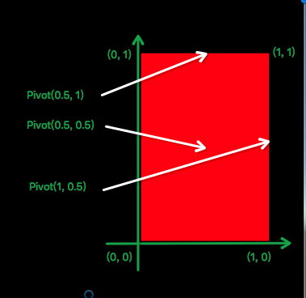
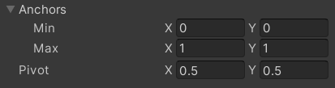
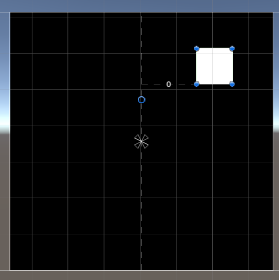
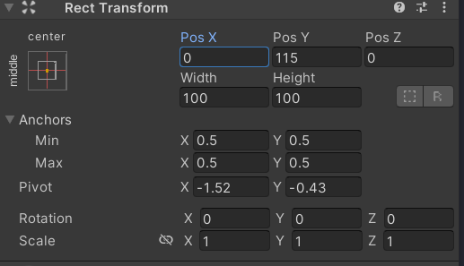
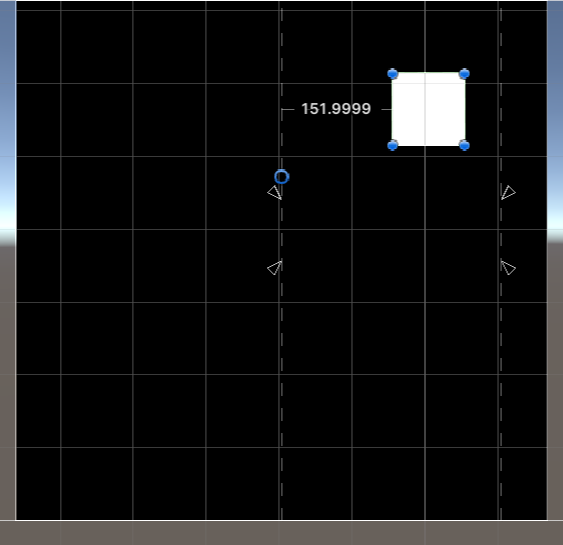
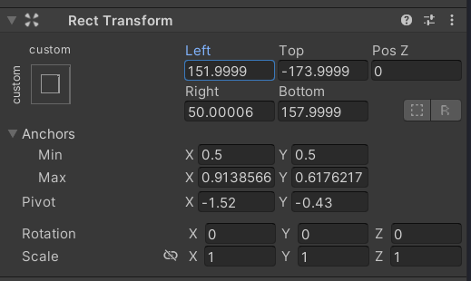

# RectTransform 组件解析

<!-- markdown-toc GFM -->

- [RectTransform 组件解析](#recttransform-组件解析)
  - [Pivot](#pivot)
  - [Anchors](#anchors)
    - [Anhors的状态](#anhors的状态)
  - [Inspctor中Pivot, Anchor,以及Position之间的关系](#inspctor中pivot-anchor以及position之间的关系)
    - [情形一：Anchor两个点重合时](#情形一anchor两个点重合时)
    - [情形二：Anchor两个点不互相重合时](#情形二anchor两个点不互相重合时)
  - [RectTransform组件的自动属性计算](#recttransform组件的自动属性计算)
  - [参考链接](#参考链接)

<!-- markdown-toc -->

## Pivot

Pivot 表示一个UI的中心点，它的坐标原点在自身UI的左下角，当Pivot在UI内时坐标范围在[0,1],当不在该UI内时坐标范围会超出[0,1]

## Anchors

Anchor锚框是由两个锚点(Min，Max)组成的一个矩形，如下所示

- Anchor Max: 锚框右上角的点在父物体中的坐标，坐标原点在父物体的左下角,坐标范围在[0,1], 默认值为[0.5, 0.5] 位于父物体中心
- Anchor Min: 锚框左下角的点在父物体中的坐标，坐标原点在父物体的左下角,坐标范围在[0,1], 默认值为[0.5, 0.5] 位于父物体中心

### Anhors的状态

在锚框状态下，UI的四个顶点会和Anchor矩形的四个顶点保持固定的距离, 如下所示

## Inspctor中Pivot, Anchor,以及Position之间的关系

### 情形一：Anchor两个点重合时

当Anchor两个点重合为一个点时，RectTransform组件中的Position项表示Pivot 和 该重合点的距离

### 情形二：Anchor两个点不互相重合时

当Anchor两个点不互相重合时，RectTransform组件中的Position属性会变成或部分变成Left，Right，Top，Bottom其值分别表示UI矩形左边,右边，顶边，底边距离Anchor矩形的左边，右边，顶边，底边的距离。

## RectTransform组件的自动属性计算

当在Inspector中修改一些属性时，为了让场景中的UI不发生改变Unity会在内部自动重新计算一些属性。例如当我们修改了Pivot或者是Anchor属性时，为了不让UI发生移动Unity会重新计算Position或者是Left,Right,Top,Bootm的数值。我们可以通过设置UI的Raw Model来禁用这一功能。

## 参考链接

- [Unity进阶技巧 - RectTransform详解](https://www.jianshu.com/p/4592bf809c8b)
