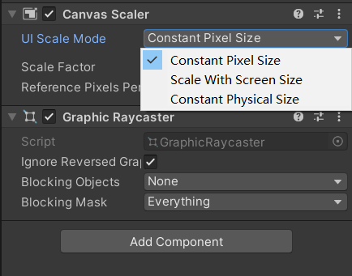
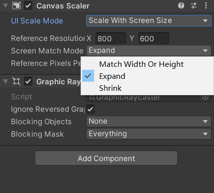

- [分辨率](#分辨率)
- [适配方式](#适配方式)
  - [铺满屏幕](#铺满屏幕)
  - [ShowAll模式](#showall模式)
  - [NoBorder模式](#noborder模式)
  - [FixedWidth 和 FixedHeight](#fixedwidth-和-fixedheight)
- [Unity 中的UI适配](#unity-中的ui适配)
  - [UI Scale Mode](#ui-scale-mode)
  - [Scale With Screen Size 下的缩放方式](#scale-with-screen-size-下的缩放方式)
- [参考链接](#参考链接)


# 分辨率

三种分辨率

- 图片分辨率
- 设计分辨率
- 屏幕分辨率

一般来说美术会根据预先设定好的设计分辨率来出图，来保持UI资源的一致性.

# 适配方式

常见有四种适配方式, 假设

```
 ScaleX = 屏幕分辨率宽 / 设计分辨率宽 
 ScaleY = 屏幕分辨率高 / 设计分辨率高
```

## 铺满屏幕

直接使用ScaleX 和 ScaleY 来对 UI元素进行缩放，使用这种方式的话UI元素受到非等比缩放会造成图片变形问题

## ShowAll模式

使用 min(ScaleX, ScaleY) 来对UI元素进行缩放，可以保证UI元素不会变形并且所有的UI都会显示在屏幕中,但是屏幕边缘会出现黑边。

## NoBorder模式

使用max(ScaleX, ScaleY) 来对UI元素进行缩放，可以保证UI元素不会变形并且屏幕不会出现黑边，但是UI内容有可能会超出屏幕.

## FixedWidth 和 FixedHeight

这种方案会改变设计分辨率的大小，以FixedHeight为例，它会固定设计分辨率高度，而新的设计分辨率宽度 = 屏幕宽度 / ScaleY (UI 元素会进行缩放) 。然后再使用ScaleY 去缩放(UI 元素再次缩放)。FixedWidth同理。

FixedWidth 和 FixedHeight 的区别在于固定的是宽度还是高度。如果选择 FixedWidth 方案，那么游戏画面在不同设备上的高度会有所不同，但是宽度始终保持不变。如果选择 FixedHeight 方案，那么游戏画面在不同设备上的宽度会有所不同，但是高度始终保持不变。

# Unity 中的UI适配

Unity 是通过Pivot，Anchor， Canvas Scaler来进行UI的布局和大小适配.其中Canvas Scaler 用来处理UI元素的缩放。

## UI Scale Mode



- Constant Pixel Size - 无论在什么分辨率下都保持UI元素的像素尺寸不变. 不变的只是UI元素的像素尺寸，UI元素的实际大小还是会随着具体的屏幕分辨率变化
- Constant Physical Size - 无论在什么分辨率下都保持UI元素的实际大小不变
- Scale With Screen Size - 根据实际的屏幕分辨率来缩放UI元素

## Scale With Screen Size 下的缩放方式



- Expand - 该模式确保全部UI元素不会被裁剪，使用的是 ShowAll 模式来进行UI元素的缩放
- Shrink - 该模式确保画面不会有空隙, 使用的是NoBorder 模式来进行UI元素的缩放
- Match Width or Height - 当Match的数值为0时，Unity会根据ScaleX 来进行UI元素的缩放，当Match的值为1时，Unity会根据ScaleY来进行UI元素的缩放. 当Match 的数值介于[0,1] 之间时则为两则的混合


# 参考链接

- [手机游戏ui如何适配不同屏幕？ - 蟑螂恶霸的回答 - 知乎 ](https://www.zhihu.com/question/338194016/answer/2959368225)
- [Unity 的UI适配原理 - 阿文的文章 - 知乎 ](https://zhuanlan.zhihu.com/p/621178139)