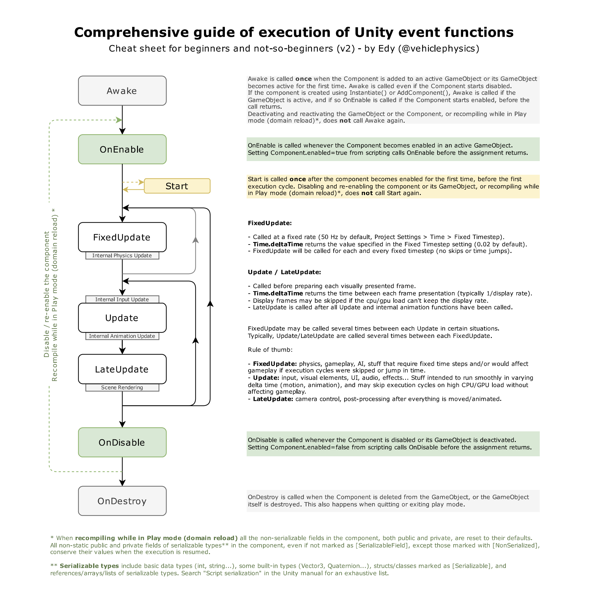

<!-- markdown-toc GFM -->

* [生命周期流程](#生命周期流程)
* [函数调用细节](#函数调用细节)
    * [Awake() 函数](#awake-函数)
    * [OnEnable() 函数](#onenable-函数)
    * [Rest() 函数](#rest-函数)
    * [Start() 函数](#start-函数)
    * [FixedUpdate() 函数](#fixedupdate-函数)
    * [Update() 函数](#update-函数)
    * [LateUpdate() 函数](#lateupdate-函数)
    * [OnDisable() 函数](#ondisable-函数)
* [具体场景](#具体场景)
    * [加载场景时](#加载场景时)
    * [在游戏第一帧执行之前](#在游戏第一帧执行之前)
    * [创建GameObject时](#创建gameobject时)
    * [销毁GameObject时](#销毁gameobject时)
* [最佳实践](#最佳实践)
    * [不同物体上周期函数的执行顺序](#不同物体上周期函数的执行顺序)
* [参考链接](#参考链接)

<!-- markdown-toc -->

# 生命周期流程




# 函数调用细节


## Awake() 函数

用于初始化

```
当GameObject被实例化并且处于激活状态下才被调用
```

## OnEnable() 函数

当组件被激活的时候被调用

```
当GameObject处于激活状态,激活组件时被调用
```

## Rest() 函数

```
在PlayMode下不生效, 当组件首次添加到Gameobject或者主动点击组件的Reset按钮时调用(触发Reset命令)被调用

无论GameObject和组件是否被激活都不影响其调用
```
 
## Start() 函数

``` 
当GameObject和组件同时处于激活状态下才被调用
```

## FixedUpdate() 函数

物理更新函数，用于进行物理模拟的更新。它理想上是经过一个段固定的时间间隔被调用一次。

```
当GameObject和组件同时处于激活状态下调用

当游戏的帧率比较低的时候，FixedUpdate函数有可能在一帧中被多次调用，被帧率比较高的时候它可能在两帧之间或者多帧之间被调用一次.
```

## Update() 函数

每帧调用一次.

```
当GameObject和组件同时处于激活状态下调用
```

## LateUpdate() 函数

每帧被调用一次, 与Update函数在同一帧被调用

```
保证场景中的所有物体的Update函数都被调用后才进行调用

当GameObject和组件同时处于激活状态下调用
```

## OnDisable() 函数

当组件被禁用时被调用
```
当组件处于激活状态禁用GameObject时被调用
当GameObject处于激活状态时禁用组件时被调用
```

--------------

# 具体场景

## 加载场景时

加载场景时Unity首先会调用所有可以被调用的Awake函数，确保Awake函数在任意Start函数被调用之前调用。随后调用所有可以被调用的Enable函数

## 在游戏第一帧执行之前

在游戏第一帧执行之前, Unity会调用所有被加载Object的Awake函数，并且在任意Update函数被调用之前调用所有可以被调用的Start函数.

## 创建GameObject时

当使用Instantiate或者AddComponent等方式实例化对象或者添加组件的时候，如果GameObject被激活那么在函数返回前Unity会调用它的Awake函数，倘若组件也处于激活状态那么在函数返回前OnEnable函数也会被调用。

根据创建或者添加组件时所处于的PlayerLoop阶段，该脚本可能会在当前帧调用Update, LateUpdate等函数，但是要注意在该脚本的任意Update，LateUpdate等函数被调用之前Unity会调用它的Start函数

## 销毁GameObject时

当使用Destroy或者是DestroyImmediate销毁GameObject或者组件的时候, 如果GameObject处于激活状态并且Object也处于激活状态那么函数返回前Unity会调用它的OnDisable函数. 然而无论GameObject和Object是否处于激活状态在函数返回前Unity都会调用OnDestroy函数

---------------

# 最佳实践

## 不同物体上周期函数的执行顺序

除非被显示的文档化和可设置的，同一个事件函数在不同GameObject上的执行顺序是不固定的.
不同组件的周期函数的执行顺序可以通过 Project Setting 中的 Execution Order 面板来进行设置


# 参考链接
- [A Comprehensive Guide to the Execution Order of Unity Event Functions](https://forum.unity.com/threads/a-comprehensive-guide-to-the-execution-order-of-unity-event-functions.1381647/)
- [Order of execution for event functions](https://docs.unity3d.com/Manual/ExecutionOrder.html)

