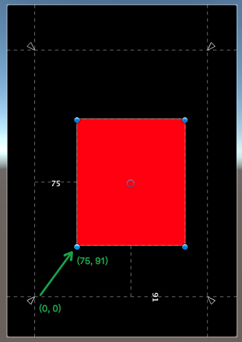
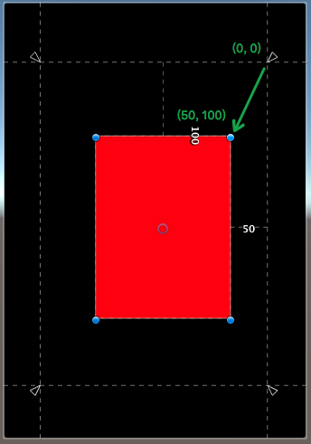
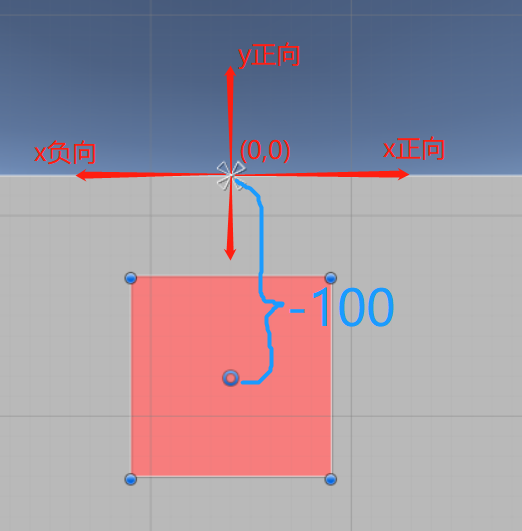
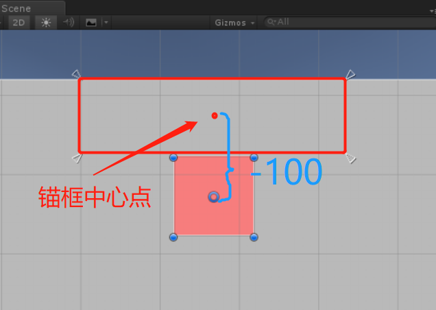
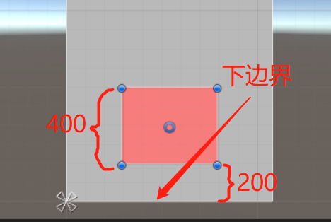

# Unity UGUI学习

## Unity UGUI Canvas
Canvas划分是个很大的话题。简单来说，因为一个Canvas下的所有UI元素都是合在一个Mesh中的，过大的Mesh在更新时开销很大(**Canvas 网格重建**)，所以一般建议每个较复杂的UI界面，都自成一个Canvas(可以是子Canvas)，在UI界面很复杂时，甚至要划分更多的子Canvas。同时还要注意动态元素和静态元素的分离，因为动态元素会导致Canvas的mesh的更新。最后，Canvas又不能细分的太多，因为会导致Draw Call的上升。

当Unity的Canvas进行网格构建的时候，会将其下所有的UI元素基于元素渲染顺序和所使用的到的Material进行一次排序，这样做的目的在于降低DrawCall的次数。当Canvas下的元素数量越大这种网格重建的耗时就越高。

- 当我们修改UI组件上的Color属性的时候会导致该UI组件所属Canvas进行网格重建。
- 当我们通过脚本去修改UI组件中使用到shader的Init_Color属性时，并不会导致Canvas进行网格重建，但是会增加一次DrawCall，因为用代码去修改的时候，Unity会自动的创建一个原来Material 的拷贝。不同的Material 是不会被Batch到一起的。
- 粒子系统的渲染和UI系统的渲染是分开的，所以一个绑定粒子效果的Canvas，并不会因为这个粒子系统而导致重建。

## Unity UI布局

### RectTransform 组件属性

#### Pivot
Pivot 表示一个UI的中心点，它的坐标原点在UI的左下角，在UI内坐标范围[0,1]

#### Anchors
Anchor锚框是由两个锚点(Min，Max)组成的一个矩形，当然也可以组成一个点（两个点重合）。当Anchor是一个锚框的时候UI元素的边界会和锚框保持一个固定的值。

当我们想要让UI元素和父物体中的某个位置保持一个不变的距离的时候使用锚点。

==Anchor Max==
锚框右上角的点在父物体中的坐标，坐标原点在父物体的左下角,坐标范围在[0,1]

==Anchor Min==
锚框左下角的点在父物体中的坐标，坐标原点在父物体的左下角,坐标范围在[0,1]

#### OffsetMax,OffsetMin
offsetMin 表示UI元素的左下角相对AnchorMin的偏移量，offsetMax表示UI元素右上角相对AnchorMax的偏移
offsetMin = UI元素的左下角 - AnchorMin
offsetMax = UI元素右上角 - AnchorMax

#### sizeDelta
sizeDelta = offsetMax - offsetMin
当Anchor为一个锚点的时候该变量可以表示UI元素的大小,此时可以通过该值改变UI元素的大小。

#### anchorPosition
UI元素轴心点距离锚点的距离，坐标原点是锚点的位置，当Anchor为锚框的时候锚点的位置锚框的中心点。

#### rect
一个UI元素的Rect属性，无论Anchor是在锚点状态还是在锚框状态下都可以获取到UI的实际大小。
rect.x和rect.y表示的是以UI的Pivot为原点UI元素左下角的坐标。

--------------
### 常用的布局方法

#### [RectTransform.SetSizeWithCurrentAnchors(Animations.Axis axis, float size)](https://docs.unity3d.com/ScriptReference/RectTransform.SetSizeWithCurrentAnchors.html)
这个方法无论在Anchor为锚点还是锚框的情况下，都可以通过直接设置rect中的width和height值来改变UI元素的大小。并且在改变大小的同时UI元素的anchorPosition保持不变

#### [SetInsetAndSizeFromParentEdge(RectTransform.Edge edge, float inset, float size)](https://docs.unity3d.com/ScriptReference/RectTransform.SetInsetAndSizeFromParentEdge.html)
调用这个方法，可以根据父物体的Edge（某一边）去布局。其中第一个参数就是用于确定基准的边，第二个参数是UI元素的该边界与父物体该边界的距离，第三个元素是设定选定轴上UI元素的大小

在使用这个方法的时候要注意锚点也会改变，改变的规则为

- 以左边界为基准时，anchorMin和anchorMax 的y不变x变为0.
- 以右边界为基准时，anchorMin和anchorMax 的y不变x变为1.
- 以上边界为基准时，anchorMin和anchorMax 的x不变y变为1.
- 以下边界为基准时，anchorMin和anchorMax 的x不变y变为0.

#### [GetWorldCorners(Vector3[] fourCornersArray)](https://docs.unity3d.com/ScriptReference/RectTransform.GetWorldCorners.html)
使用这个方法，可以取得UI元素四个角的世界坐标具体使用方法，先建立一个长度为4的vector3数组，然后传进这个方法，调用一次后，数组被赋值，里面的四个元素分别是UI的左下角 ，左上角，右上角，右下角。

## Canvas Scale

## 设计适应不同屏幕分辨率的UI
[设计适应不同屏幕分辨率的UI - Noahha的文章 - 知乎](https://zhuanlan.zhihu.com/p/100842584)