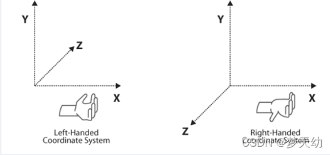

<!-- markdown-toc GFM -->

* [Unity 中的坐标系](#unity-中的坐标系)
    * [世界坐标系](#世界坐标系)
    * [局部坐标系](#局部坐标系)
    * [自身坐标系](#自身坐标系)
    * [视口坐标系](#视口坐标系)
    * [屏幕坐标系](#屏幕坐标系)
    * [GUI 坐标系](#gui-坐标系)
    * [参考资料](#参考资料)

<!-- markdown-toc -->

# Unity 中的坐标系

## 世界坐标系

Unity 中所有物体依据该坐标系被创建和定位。该坐标系有左手坐标系和右手坐标系两种形式，如下所示，Unity采用的是左手坐标系

## 局部坐标系

局部坐标系是物体相对于其父物体的坐标系 ,Unity 中 Transform组件在Inspector中显示的不是物体的世界坐标系而是物体的局部坐标系.

## 自身坐标系

自身坐标系是以物体自身为中心的坐标系，该坐标系主要用于物理计算当中用来简化计算

## 视口坐标系

视口坐标系又叫NDC坐标系(归一化设备坐标系)其作用主要模型变换到具体的屏幕空间中将任意的屏幕坐标系进行归一化表示. 视口坐标系左下角为(0,0), 右上角为(1,1)

## 屏幕坐标系

屏幕坐标系就是把屏幕看作一个坐标系，从左下角开始计算，也就是(0,0)，而右上角则是(Screen.widht,Screen.height)，所以又叫做像素坐标系

## GUI 坐标系

该坐标系是从左上角开始计算的，左上角(0,0)，右下角为(Screen.width,Screen.height);

## 参考资料

-[【详解Unity】各种坐标系 | 世界坐标 | 屏幕坐标 | UI坐标](https://www.bilibili.com/video/BV1ES4y1i7H6/?vd_source=bb33286cda74be54bbcdf853e121e4f7)
- [简单理解Unity3D中的四种坐标体系 - 小王子的文章 - 知乎](https://zhuanlan.zhihu.com/p/86088176)
