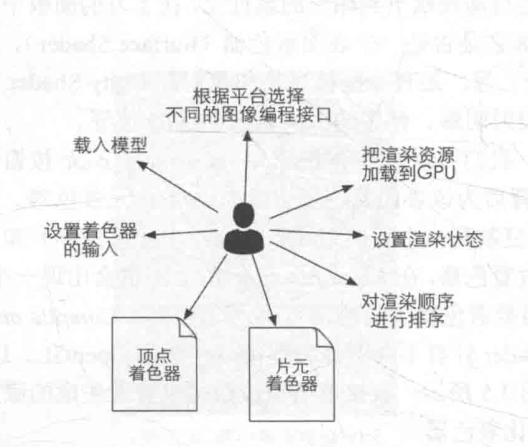
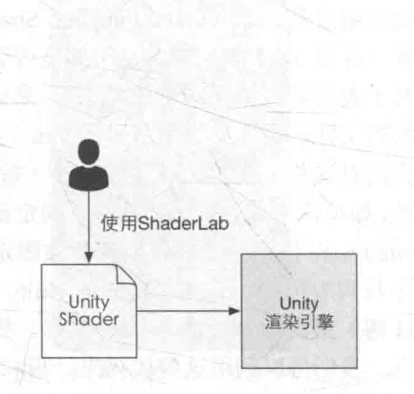
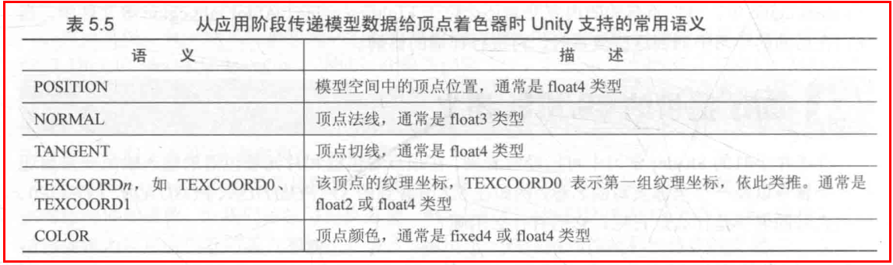
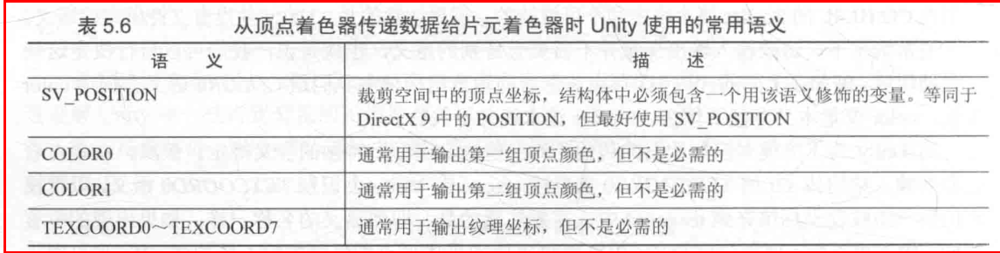
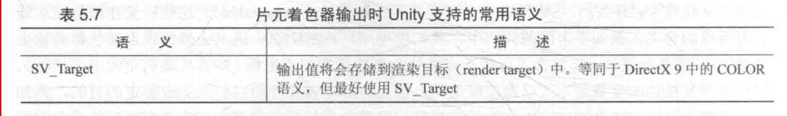

# Unity Shader 和材质
unity 中通过 unityShader + 材质来实现想要的各种显示效果. UnityShader定义了渲染所需的各种代码(顶点着色器和片元着色器), 属性(使用哪些纹理)以及指令(渲染和标签设置等), 而材质则允许我们调节这些属性并将其赋予给相应的模型

# Unity Shader 和shaderLab

unity Shader 本质上只是一个文本文件, 在没有unity Shader的情况下想要实现特定的渲染效果通常需要修改多个程序文件和多个shader文件，该过程十分的繁琐一不小心就有可能出错，而为了简化这个流程。unity将此过程封装了起来并提供了一层抽象这就是UnityShader。为了和这层抽象打交道unity 提供了一种专门为UnityShader 服务的语言 Shaderlab. 

Unity在背后会根据使用的平台来把这些结构编译成真正的代码和Shader文件

在没有UnityShader 的情况下, 实现某种渲染效果时需要做的修改。



有了Unity Shader之后



# Unity Shader的结构

一个简单的顶点/片元着色器
~~~GLSL
Shader "Shader的名字，通过增加'/'来细分种类"
{
    Properties
    {
		//Name:属性的名字
		//display name：显示在材质面板上的名字
		//PropertyType：类型
		//DefaultValue：默认值
		Name("display name",PropertyType) = DefaultValue
    }
    SubShader
    {
		//可选标签，例如：Tags{"Queue"="Transparent"}
		[Tags]
		//可选状态
		[RenderSetup]
		//通道，每个通道定义了一次完整的渲染流程，但是如果数目过多会造成渲染性能的下降。
		Pass
		{
			[Name]
			[Tags]
			[RenderSetup]
		}
		//其他通道
		//Other Pass
    }
    Fallback "VertexLit"
}
~~~

- Properties
    - 材质与UnitySahder的桥梁. 被定义的属性会出现在材质面板中
- SubShader
    - 每个UnityShader可以包含多个SubShader语义块，但至少要有一个。 当Unity加载这个Shader时，会扫描所有SubShader语义块，然后选择第一个能在目标平台运行的SubShader，如果都不支持的话，Unity就会使用Fallback语义指定的Unity Shader。
- Pass
    - Pass 定义了一次完整的渲染流程(里面包含顶点着色器和片元着色器). pass 中同样可以定义 Tags 和 RenderSetup
- Tags
    - Tags 的作用是告诉Unity的渲染引擎,我们希望怎样以及何时渲染对象. Pass块虽然也可以定义标签，但是这些标签是不同于SubShader的标签类型。
- RenderSetup
    - 可以设置显卡的各种状态，例如是否开启混合/深度测试等,当在SubShader块中设置了上述渲染状态时。将会应用到其中的所有的Pass。 如果不想这样，我们可以在Pass中单独设置状态。
- Fallback
    - 如果其它的SubShader都无法运行那么Unity就会运行Fallback指定的Unity Shader. 此外为每个Unity Shader正确设置Fallback是非常重要的，这会影响阴影投射。


# Unity Shader的形式

- 表面着色器
    - 定义在SubShader语义块中而不是Pass中. Unity在背后为我们处理了很多光照细节.
- 顶点/片元着色器
    - 定义在Pass中而非SubShader中,通过它我们可以控制渲染的实现细节，灵活性很高.
- 固定函数着色器
    - 为了支持老式设备已经被淘汰了


# Unity Shader 和CG/HLSL的关系

Unity Shader是用ShaderLab编写的，但是对于表面着色器和顶点片元着色器，我们可以在ShaderLab内部嵌套CG/HLSL语言来编写这些着色器代码。这些CG/HLSL代码是嵌套在CGPROGRAM和ENDCG之间的。在Unity中，CG和HLSL是等价的。
通常，CG代码片段位于Pass语义块内部。

# Unity 提供的内置文件和变量

- 为了方便开发者的编码过程, Unity提供了很多内置文件. 这些文件包含了很多提前定义的函数,变量和宏等. (在Unity2021 中我们可以通过查看Unity Editor安装目录\Editor\Data\CGIncludes 来查看这些内置文件). 这些文件一般以.cginc为后缀名。 可以通过#include指令来使用这些内置文件
- 有一些文件即使我们没有使用 #include 指令,它们也是会被自动包含进来的.例如 UnityShaderVariables.cginc。(它定义了如UNITY_MATRIX_MVP等变量)

# Unity 提供的CG/HLSL语义

```HLSL
Shader "UnityShaderBook/Chapter5/SimpleShader"
{
    Properties
    {
    }
    SubShader
    {
        pass{
            CGPROGRAM
            #pragma vertex vert
            #pragma fragment frag

            float4 vert(float4 v : POSITION): SV_POSITION {

                return UnityObjectToClipPos(v);
            }

            fixed4 frag(): SV_TARGET {

                return fixed4(1.0, 1.0, 1.0, 1.0);
            }

            ENDCG
        }
    }
    FallBack "Diffuse"
}
```
- 代码中诸如: POSITION, SV_POSITION,SV_TARGET等修饰符,被称为CG/HLSL语义, 它的作用是让Shader(或者说渲染管线) 知道从哪里读取数据，并把数据输出到哪里。 是不可或缺的。
- 需要注意的是Unity并没有支持所有的语义，并且Unity为了方便对模型数据进行传输，对一些语义进行了特别的含义规定。例如当作为顶点着色器的输入变量时被TEXCOORD0描述的变量会被传入模型的第一组纹理坐标.
- DirectX10之后引入了一种新的语义类型，就是系统数值语义一般使用SV作为前缀例如(SV_POSITION, SV_TARGET等). 用这些语义描述的变量是不可以随便赋值的，因为渲染流水线需要使用它们来完成特定的目的。
- 某些平台可能规定有特殊含义的变量必须使用SV开头的语义进行修饰，因此为了让Shader有更好的跨平台性，对于这些特殊含义的变量我们最好使用SV开头的语义进行修饰。


Unity中常用的语义如下




# UnityShader 的Debug方式
- 假彩色图
- VS
- Unity 的帧调试器
