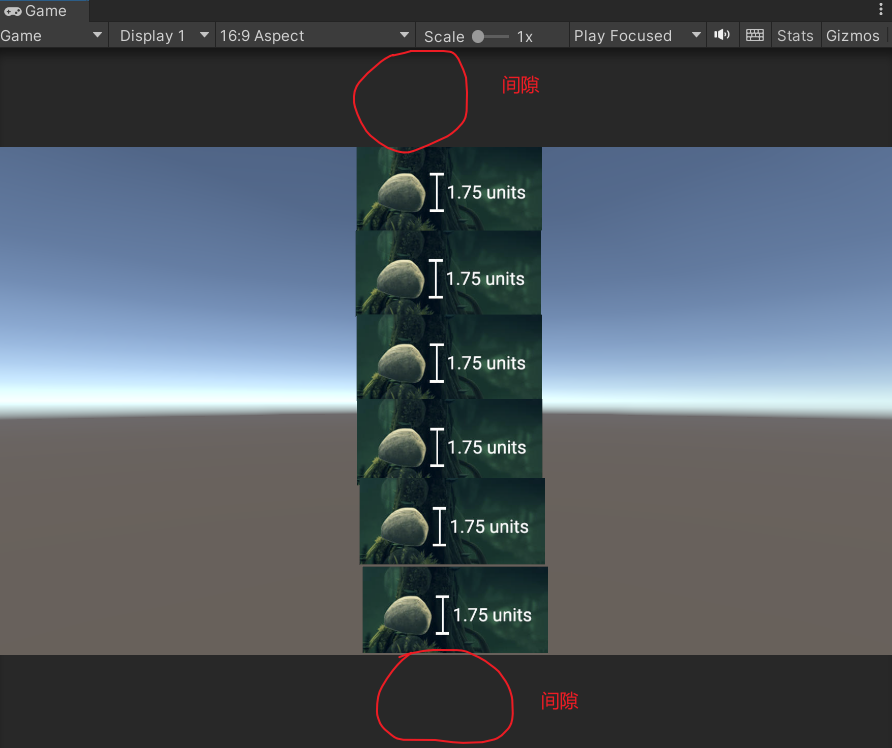
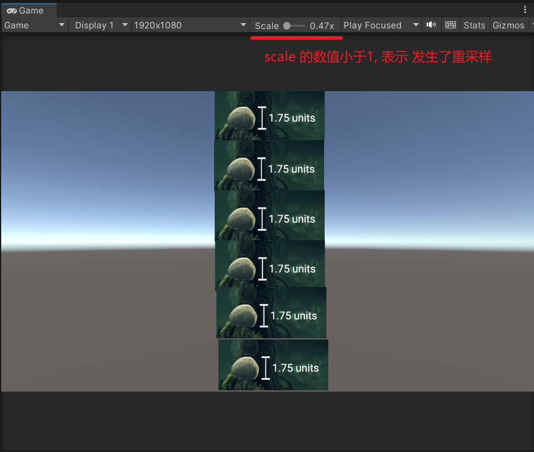

<!-- markdown-toc GFM -->

* [Game 窗口的更新 频率](#game-窗口的更新-频率)
* [Game 窗口 的分辨率设置](#game-窗口-的分辨率设置)
    * [Aspect rations](#aspect-rations)
    * [Fixed Resolutions](#fixed-resolutions)
* [参考链接](#参考链接)

<!-- markdown-toc -->

# Game 窗口的更新 频率

在Editor Mode 下，Game 窗口通常只在某些事件发生时才进行更新，而在 Play Mode 下Game 窗口每一帧都会刷新

# Game 窗口 的分辨率设置

Game窗口的分辨率设置有两种 

- **Aspect rations**
- **Fixed resolutions**

##  Aspect rations

这种方式下游戏窗口会使用当前的分辨率(即当前Game窗口的像素大小)，但是会让其保持设定的宽高比. 多余的部分会留间隙

例如在保持 16 : 9 的宽高比下Game窗口如下所示

*注意此时的Scale显示1x, 表示没有进行过缩放. 因为它是直接使用Game窗口的像素大小并没有进行过重采样*

## Fixed Resolutions 

在这种模式下，Unity不会直接使用Game窗口的分辨率（像素大小）而会强制使用固定的分辨率来渲染游戏画面，然后再将游戏画面渲染到Game窗口上。这种情况下有可能发生重采样

例如在使用1920 * 1080 分辨率下的Game窗口如下所示

*注意如果scale 的数值小于1, 则表示发生了重采样*

# 参考链接

- [Choosing the resolution of your 2D art assets](https://blog.unity.com/engine-platform/choosing-the-resolution-of-your-2d-art-assets)
