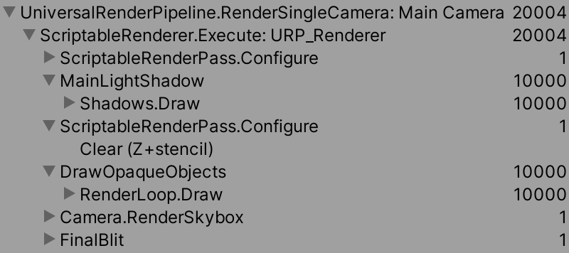
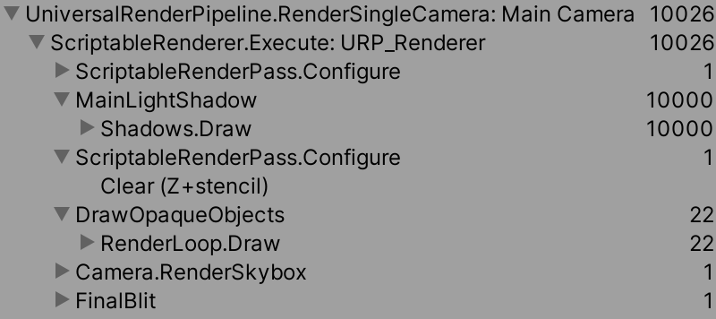
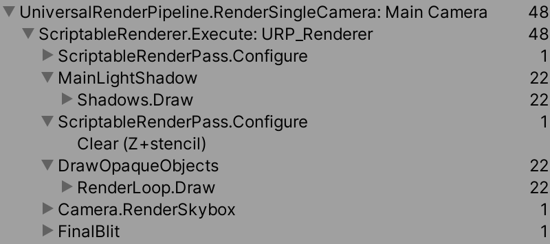
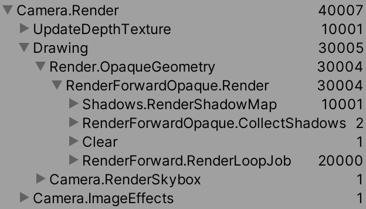
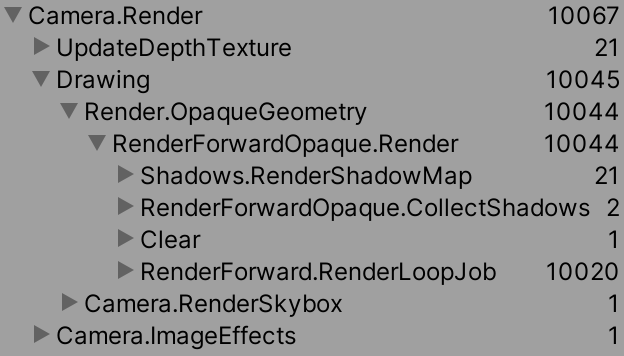
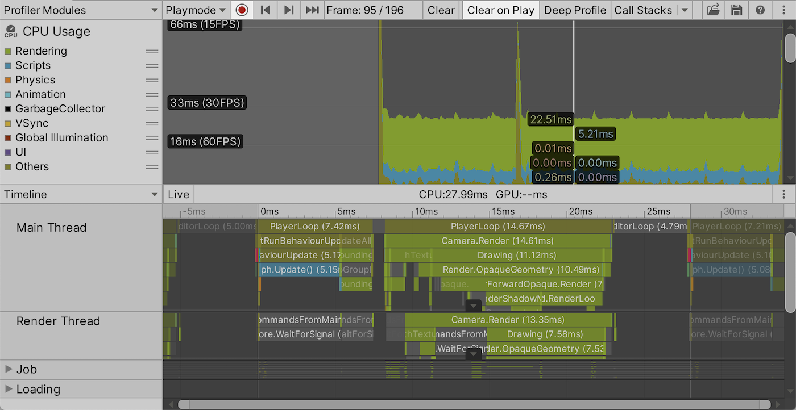
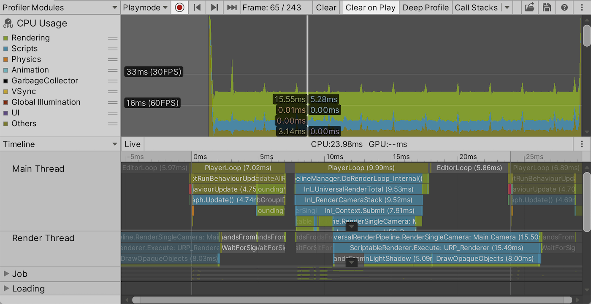

<!-- markdown-toc GFM -->

- [Unity 提供的渲染技术](#unity-提供的渲染技术)
- [通过Frame Debugger 来观察GPU的性能开销](#通过frame-debugger-来观察gpu的性能开销)
  - [Dynamic Batching 和 GPU Instancing 在BRP和URP中的表现](#dynamic-batching-和-gpu-instancing-在brp和urp中的表现)
  - [多光源状态下的Dynamic Batching 和GPU Instancing](#多光源状态下的dynamic-batching-和gpu-instancing)
    - [BRP](#brp)
    - [URP](#urp)
- [通过Profiler 来观察CPU的性能开销](#通过profiler-来观察cpu的性能开销)

<!-- markdown-toc -->

# Unity 提供的渲染技术

- `SRP Batcher`:  通过提高每次DrawCall Batching 的效率来提高帧率，但不会减少DrawCall的数量。
- `Dynamic Batching` : 通过将多个网格合并成一个网格,然后通过单个DrawCall来绘制该合并网格的方式来减少DrawCall的数量
- `GPU Instancing` : 通过单个DrawCall 来绘制多个物体, 也可以使用来减少DrawCall的数量

# 通过Frame Debugger 来观察GPU的性能开销

## Dynamic Batching 和 GPU Instancing 在BRP和URP中的表现

在BRP下一般来说Dynamic Batching 相比于GPU Instancing 更能减少DrawCall的数量. 而在URP下，因为 Dynamic Batching 是不会作用在URP的Shadows.Draw 过程中的，而GPU Instancing则会作用在Shadows.Draww 过程中. 因而 GPU Instancing 更能起到减少DrawCall的作用

在URP中，不开启 Dynamic Batching ，GPU Instancing的状态下

 

 开启Dynamic Batching的状态下

 

 开启GPU Instancing的状态下

 

## 多光源状态下的Dynamic Batching 和GPU Instancing

### BRP 

当场景中存在两个个光源时，对于每一个光源都需要绘制一次物体，因此BRP中的RenderForward.RenderLoopJob(Forward Pass)的绘制数量会多出一倍, 如下所示

Dynamic Batching 此时只会作用在BRP中的 Depth Pass 和 Shadow Pass 部分而不会作用在 Forward Pass 部分 。如下图所示

GPU Instancing 则会作用在BRP 中的Depth Pass ，Shadow Pass 以及部分 Forward Pass中(作用在Forward Pass 中的main Pass部分, main pass 代表主光源的pass 其他的光源对应的pass 称为 additional light pass)。如下图所示

### URP

URP的绘制命令数量不会受光源数量的影响，因此在URP中多光源场景和单光源场景的绘制 Command List 不会有不同。即使实际上GPU做了更多的光照计算。

# 通过Profiler 来观察CPU的性能开销

通过使用Profiler可以查看在不同线程上函数的执行情况, 时间开销，内存分配等等

使用BRP的Profiler

使用URP的Profiler

`注意这些线程之间有可能会进行同步, 线程也可以出现跨帧边界。这是因为 Unity 利用了并行性，在渲染线程完成之前，主线程可能会执行下一帧的更新循环。`